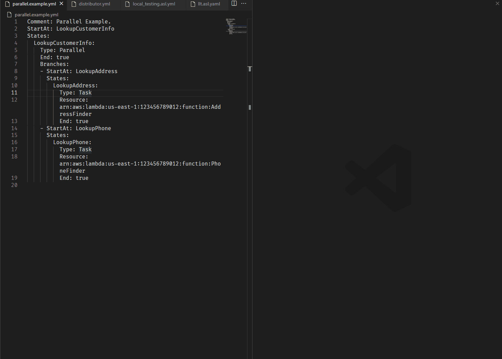

# VS Code - AWS Step Functions Preview

This extension lets you see what your state machine looks like in graphical format. This will help you in writing and maintaining your workflow in code.

Preview happens on opening or saving a file.



## Features

* Sfn Preview doesn't use 'amazon-states-language-service' to manage sfn files. 
* It has its own version of parsing and validating sfn files.
* You can open the preview panel by:
  * clicking 'Open Sfn Preview to the Side' on the title bar and context.
  * running 'Sfn Preview: Open Sfn Preview to the Side' command.
* Support the following extensions: .yaml; .yml .asl.yaml

## Installing the Extension

In the Extensions pane, search for "Sfn Preview" extension and install it there. You will get notified automatically about any future extension updates.

## Useful Commands

Command | Description
--- | ---
```Sfn Preview: Open Preview to the Side``` | Open state machine preview to the side.
```Sfn Preview: Toggle raw content``` | Display Mermaid code for workflow.

## Backers

<a href='https://ko-fi.com/V7V3F4TJ0' target='_blank'></a>

**Enjoy!**